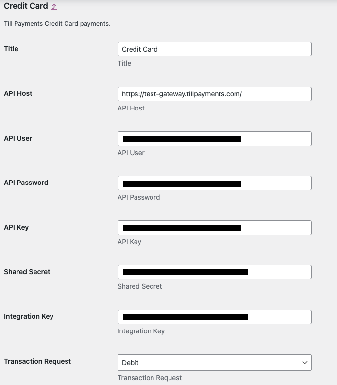
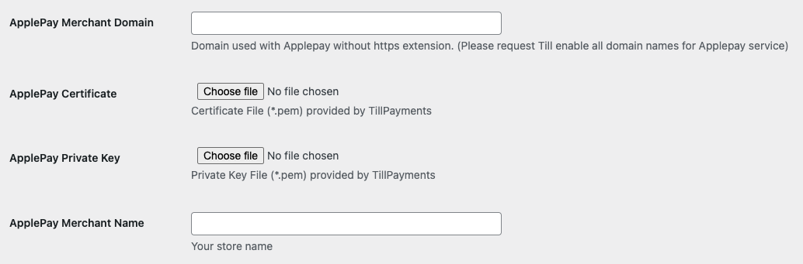
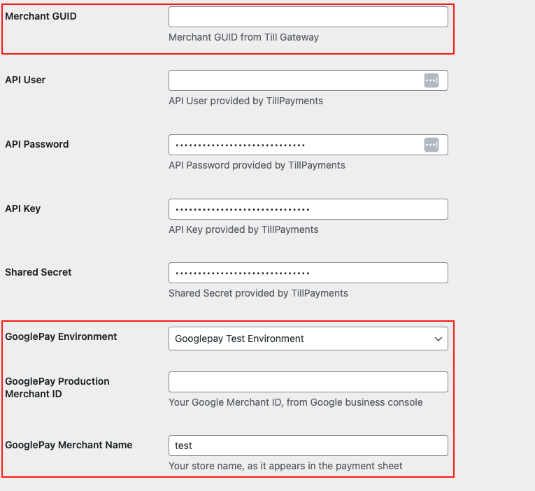
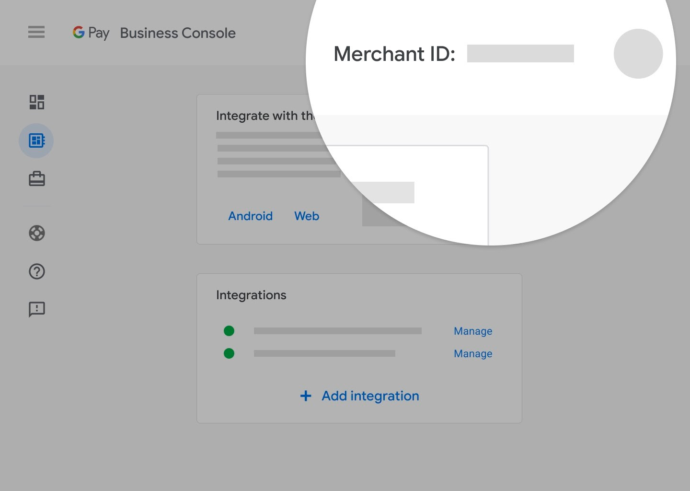

# Woocommerce Till Payments Plugin

Contributors: Till Payments\
Tags: Credit Card, e-commerce, payment, processing, checkout\
Requires Wordpress: 4.9\
Tested up to Wordpress: 6.2\
Requires Woocommerce: 3.6.0\
Tested up to Woocommerce: 7.5.1\
Requires PHP: 7.2.5\
Stable tag: 1.10.2

## Description

Till Payments is a multi-region Acquirer offering an omnichannel card present and card not present solution for merchants looking for a one stop payments solution.

The installation and activation of this plugin allows a merchant's store to integrate directly to the Till Payments Gateway API layer.
Please refer to https://tillpayments.com/ for merchant sign-up and more info.

## Plugin Functions

- Debit
- Preauthorise + Capture
- 3DSecure (3DS v2)
- Applepay
- Googlepay

## Installation

1. Upload the plugin files to the `/wp-content/plugins/tillpayments` directory, or install the plugin through the WordPress plugins screen directly.
   (**IMPORTANT**: If uploaded via Wordpress please ensure the plugin is placed into the path above / named accordingly)
1. Activate the plugin through the 'Plugins' screen in WordPress

## Plugin Activation

1. Go to `WooCommerce` > `Settings` > `Payments` in your store's backoffice admin area.
1. Click on `Set up` on the `Till Payments` payment method.
   1. Enter your API and payment method credentials (refer to config fields for futher info)
   1. Click on `Save changes`.
   1. Go back to `Payments` overview.
1. Enable configured `Till Payments` payment methods using the slide toggles.

## Credit / Debit Card Processing

### Config

- **Title**: what you want the payment option to be called on the storefront eg 'Credit Card'
- **API Host** = environment where your transactions will be sent
- **API Username**: Obtained from the Users section on the Gateway portal. This is the API username (not the Web user you logged in with)
- **API Password**: Password of the API user
- **API Key**: Obtained from your Gateway connector settings
- **Shared Secret**: The _Shared Secret_ obtained from your Gateway connector
- **Public Integration Key**: Obtained from your Gateway connector where it is labelled as Public Integration Key (e.g. for payment.js)

See [Till Payment's Support - Gateway Credentials](https://support.tillpayments.com/hc/en-us/articles/6694543251215-Till-Payments-Gateway-Credentials) for instructions on obtaining your production credentials

## Applepay / Googlepay Enablement

**Applepay and Googlepay will not work immeidately out of the box.**
This is because there is a setup phase for each of these payment options + requirements from Apple/Google.

### Applepay

#### Setup

- Please email Till Integrations (integrations@tillpayments.com) for Applepay enablement.
- Certificate files will be provided for you to upload (via the plugin)
- This includes a domain association file which needs to be uploaded to your server's file path **https://[DOMAIN_NAME]/.well-known/apple-developer-merchantid-domain-association**
- Once all files have been uploaded Till support engineers will invoke enablement of your setup with Apple

#### Config

The majority of the fields ie API Key, Shared Secret will be the same as what you're using for cards. This is unless of course you have a special need to route Applepay transactions to another Merchant Account Id (MID).

- **Applepay Merchant Domain**: This is your FQDN without the https:// prefix. ie and typically if your store is hosted at https://store.tillpayments.com then set this value as store.tillpayments.com
- **Applepay Certificate**: Till will give you this file to upload
- **Applepay Private Key**: Till will give you this file to upload
- **Applepay Merchant Name**: This generally your business trading name eg Till Payments

### Googlepay

#### Setup

Google requires you as the merchant to sign up and complete an integration process for production enablement. After being approved, Google supply you a production Merchant Account Id which is what is needed for your Till Payments plugin config here.

In this integration process you may need perform test transactions, which you can already do by pointing to the Google Test environment and adding these test cards to your Google account here:
https://developers.google.com/pay/api/android/guides/resources/test-card-suite

Regarding the Integration Process with Google, this is out of scope for Till. To start the process you would need to sign into your Google My Business Console and request production access following:
https://developers.google.com/pay/api/web/guides/test-and-deploy/request-prod-access
Integration Checklist:
https://developers.google.com/pay/api/web/guides/test-and-deploy/integration-checklist

#### Config

The majority of the fields ie API Key, Shared Secret will be the same as what you're using for cards. This is unless of course you have a special need to route Googlepay transactions to another Merchant Account Id (MID).

- **Merchant GUID**: Please ask Till for this value, it will be different from Sandbox vs Production
- **Googlepay Enviornment**: Env you want to target on the Google end
- **Googlepay Merchant Name**: Your business trading name
- **Googlepay Production Merchant ID**: Can place a dummy value for sandbox testing, however in production it is given by Google to you. Usually found by signing in the Google My Business Console seen in the top right

## Common User Errors

### Incorrect credentials with endpoint

There are 5 sets of credentials you'll need to be concerned about.
These are:

- API Key
- Shared Secret
- Public Integration Key
- API Username
- API Password

**If in Test** - our Integrations team will have given these credentials to you

**If in Production** - our Boarding team will have given access for you to log into the portal to recover these credentials

please ensure you're using the correct set for the correct enviornment. Sandbox credentials will not work with Production and vice versa.

### Payment input fields not loading

Ensure you have entered the correct **Integration Key** and are targeting the correct environment.

In rare cases other third party plugin can conflict with our plugin to cause undesirable behaviour. Preventing the payment inputs from loading is just one example. This is usually the case when another plugin is raising exceptions and can often be diagnosed by inspecting the server logs as well as checking the browser's console for errors while the payment page is loading.

### All payments declined in testing

While targeting our sandbox environment there is a list of acceptable test cards you can use to simulate different outcomes. Using any other made up card, or a live card number, will result in a decline.

Here are a list of the cards that can be used in the sandbox environment.

[Test Card Numbers](https://gateway.tillpayments.com/documentation/connectors#simulator-testing-connector-test-data)
